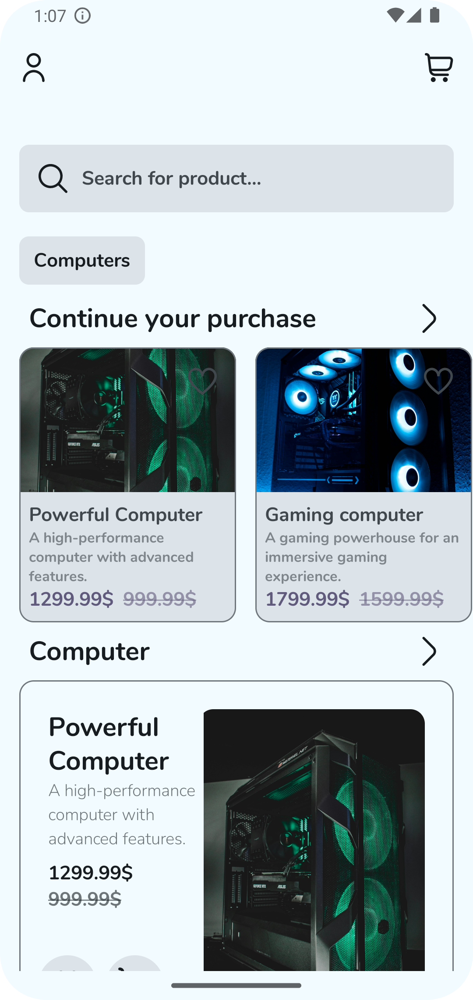
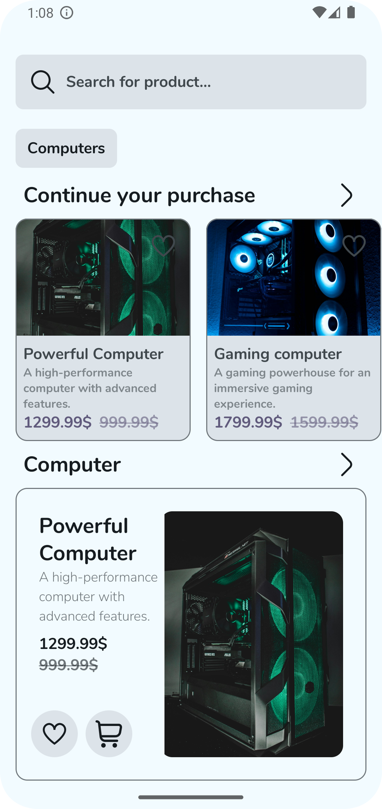
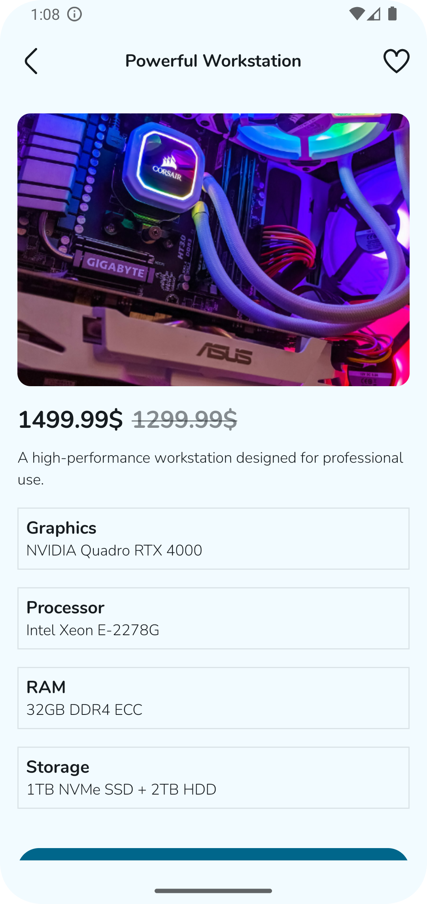
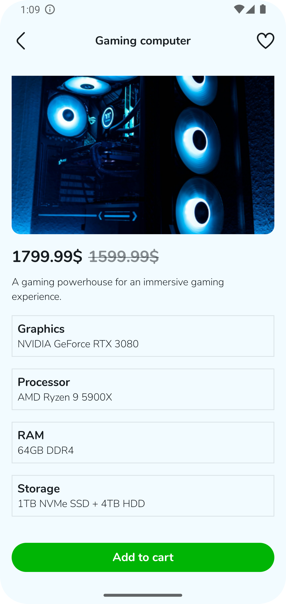
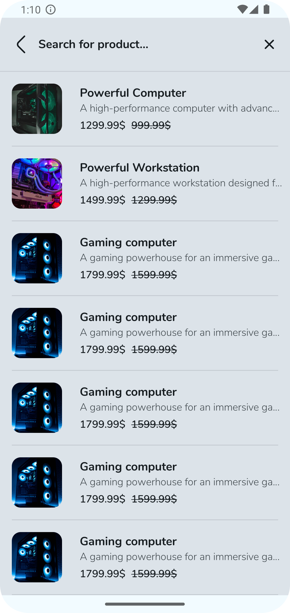
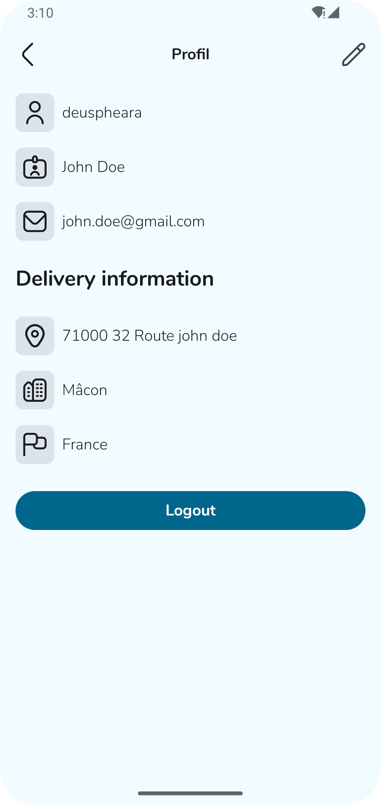
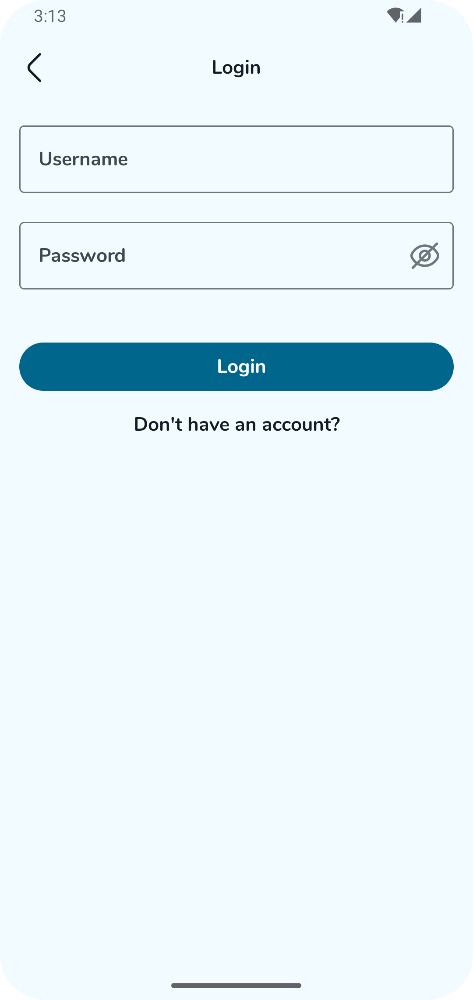
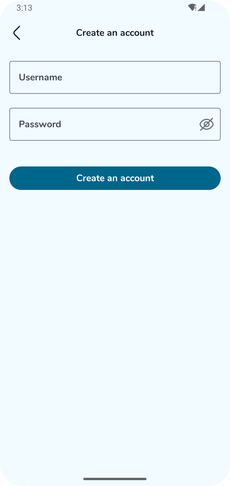
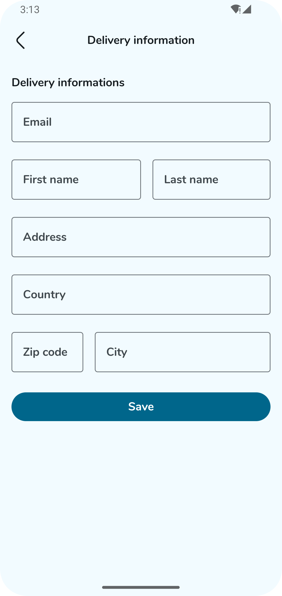

# Shop app

## Description
E-commerce app that allows users to buy and sell products. Work with a custom backend for authentication, checkout, and product management.

## Screenshots

<table>
  <tr>
    <td>Home</td>
    <td>Search</td>
    <td>Detail</td>
  </tr>
  <tr>
    <td></td>
    <td></td>
    <td></td>
  </tr>
</table>

<table>
    <tr>
        <td>Cart</td>
        <td>Search</td>
        <td>Profil</td>
    </tr>
    <tr>
      <td></td>
      <td></td>
      <td></td>
    </tr>
</table>

<table>
    <tr>
        <td>Sign in</td>
        <td>Sign up</td>
        <td>Sign up informations</td>
    </tr>
    <tr>
      <td></td>
      <td></td>
      <td></td>
    </tr>
</table>

## Features

- **Backend:** Custom backend for authentication and product management.
- **MVVM, Jetpack Compose, Dagger Hilt:** Modern architecture and tools for a clean, efficient codebase.
- **E-commerce:** Buy and sell products.
- **Authentication:** Authenticate using custom backend.
- **Cart:** Add and remove products from cart.
- **Search:** Search for products.
- **Product Detail:** View product details.
- **Add Product:** Add products to sell.
- **Profile:** View and edit profile.

## Future Features
- **Edit Product:** Edit products to sell.
- **Delete Product:** Delete products to sell.
- **Favorite:** Favorite products.
- **Payment:** Pay for products.
- **Order History:** View order history.
- **Chat:** Chat with sellers.
- **Rating:** Rate sellers.
- **Notification:** Receive notifications.
- **Settings:** Change app settings.